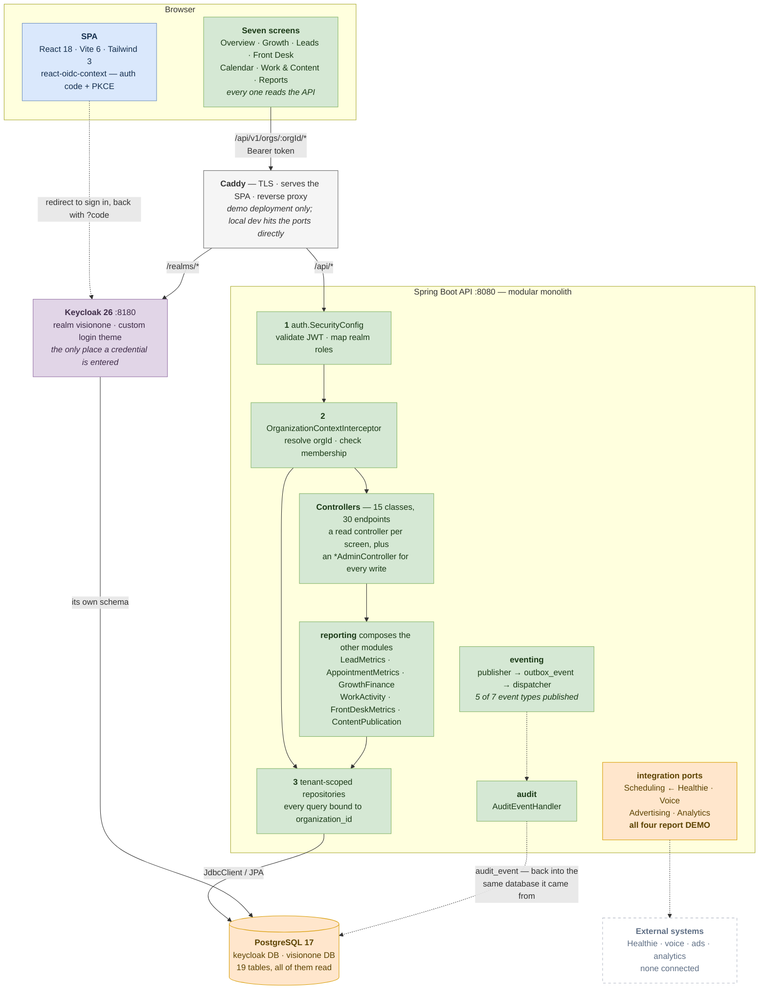
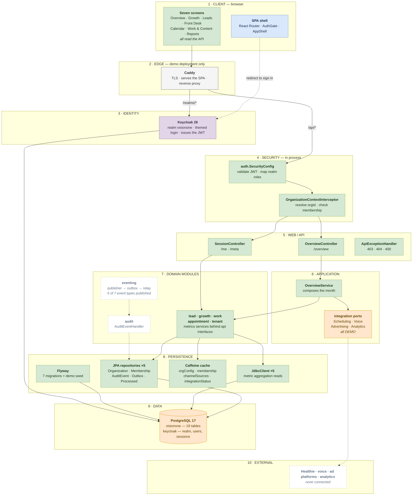

# Architecture notes

The authoritative architecture and delivery plan is the VisionOne Phase 1 document in the project
space. This file holds the parts a developer needs while in the code.

## The shape today

Everything below this heading is descriptive - what actually runs, as of the current commit. The
sections after it are normative: rules and recipes that hold regardless. Where the two appear to
disagree, they do not. "Adding an event" tells you how to publish one; this section records that
nothing publishes one yet.

### The whole picture

An editable version lives at [`architecture.drawio`](architecture.drawio) — open it at
[diagrams.net](https://app.diagrams.net) or with the Draw.io extension in VS Code. The diagram
below is the same picture, and renders inline on GitHub.



Solid edges carry traffic today. The dashed edge that still matters is the one leaving the provider
ports: every adapter behind them is a `Demo*` class, so nothing external is connected.

Two things the picture is meant to make obvious. Postgres is not optional at any point: Keycloak
stores its realm, users and sessions there, so the container stays even if the application persisted
nothing of its own. And what is still standing in is the **data**, not the code — the screens are real
and read the database; the figures in that database come from `db/demo/R__demo_seed.sql` rather than
from Healthie.

### The same system, by layer

Every component, and which layer it sits in. Arrows cross downward; nothing calls upward.

The cleanest version of this is the **Layered view** page of
[`architecture.drawio`](architecture.drawio) — ten full-width bands, browser at the top, Postgres
at the bottom. The Mermaid below is the same content and renders inline on GitHub, but its
auto-layout will not hold strict horizontal bands: with this many cross-layer edges it staggers
them sideways. Layer order is correct; alignment is not. Use the drawio page when the shape itself
matters.



The layers earn their separation in different ways. Four and five are the tenant-safety layers —
security runs before any controller, so no endpoint can forget the membership check. Eight splits
by access style rather than by module: JPA where a row has identity and a lifecycle
(`Organization`, `Membership`, and the eventing plumbing), `JdbcClient` where the work is
aggregation and an ORM would only get in the way. Ten is drawn but not wired; every adapter behind
the ports in layer six is still a `Demo*` class.

Every module in layer seven is populated now; `content` and `frontdesk` were the last two to be
filled in, and carry 13 and 10 classes respectively.

### Sign-in

```
  SPA /login
    └─▶ redirect ──▶ Keycloak /realms/visionone/protocol/openid-connect/auth
                       └── themed login page  (CSS-only theme over keycloak.v2)
                            └─▶ redirect back with ?code
                                 └── react-oidc-context exchanges code → token (PKCE)
                                      └── AuthBootstrap publishes token during render
                                           └── every apiGet sends Authorization: Bearer
```

The SPA never handles a credential, which is why the sign-in page is themed at Keycloak rather
than built in React. Theming it CSS-only means OTP, password reset and consent inherit the styling
without a forked template.

### The live request path

`GET /api/v1/orgs/{orgId}/overview` is the only endpoint that reads business data.

```
  ① auth.SecurityConfig ................ validate JWT, map realm roles
  ② OrganizationContextInterceptor ..... resolve {orgId}, verify membership
  ③ tenant-scoped repositories ......... every query bound to organization_id
        │
  OverviewController
        └── OverviewService
              ├── LeadMetrics        ◀── LeadMetricsService         ┐
              ├── AppointmentMetrics ◀── AppointmentMetricsService  │ JdbcClient
              ├── GrowthFinance      ◀── GrowthFinanceService       │
              ├── WorkActivity       ◀── WorkActivityService        ┘
              └── JdbcClient (direct)
                     └──▶ PostgreSQL
```

Injection is by interface, so the implementing classes are never named by another class. Static
"who references this" tooling reports them as unused; they are not.

### Where the data comes from

```
  Overview · Growth · Leads · Front Desk · Calendar · Work & Content · Reports
     └── GET /api/v1/orgs/{orgId}/...          15 controllers, 30 endpoints
            └──▶ tenant-scoped repositories ──▶ PostgreSQL
                   └── rows from db/demo/R__demo_seed.sql
```

Every screen reads the database. The fixture modules this section used to describe
(`demoData.ts`, `demoOperations.ts`, `demoCalendar.ts`) are gone, and so is the idea of Overview as
the single canary — any screen now fails if the API is down.

What is still synthetic is the **contents** of those tables. The seed holds three months for one
organization, deterministically generated, and the four provider ports report `DEMO` rather than
pretending to be connected. Going live is a profile change plus a real adapter, not new screens.

One consequence worth knowing: the seed covers three fixed months, so on the first day of a new month
the default view is empty until real data arrives.

### Provider ports

```
  integration.api  (port)          integration.internal  (adapter)      status
  ─────────────────────────────────────────────────────────────────────────────
  SchedulingProvider  ← Healthie   DemoSchedulingProvider               DEMO
  VoiceProvider                    DemoVoiceProvider                    DEMO
  AdvertisingProvider              DemoAdvertisingProvider              DEMO
  AnalyticsProvider                DemoAnalyticsProvider                DEMO
```

Each is `@ConditionalOnProperty(havingValue = "DEMO", matchIfMissing = true)` and reports `DEMO`
verbatim rather than implying a connection. The port is the PHI boundary:
`appointment_reference` holds an external ref, timestamps and a status, never a patient name or
anything clinical.

### Eventing: Postgres is the queue

There is no broker. A row in `outbox_event` with a null `published_at` *is* an undelivered
message, and `FOR UPDATE SKIP LOCKED` lets more than one instance drain the table safely.

```
  growth / lead / work / content
        ┊
        ┄┄▶ DomainEventPublisher ┄┄▶ outbox_event ┄┄▶ OutboxDispatcher
              (same transaction)      (published_at null)        ┊
                                                                 ┄┄▶ DomainEventHandler
                                                                        ┊
                                                      audit_event  ◀┄┄──┘

  Healthie / voice provider
        ┊
        ┄┄▶ webhook endpoint ┄┄▶ inbox_event ┄┄▶ 200 OK (milliseconds)
                                (processed_at null)
                                      ┊
                                      ┄┄▶ InboxProcessor ┄┄▶ InboxHandler
```

A row is marked published only once every interested handler succeeded. If one fails, the row
stays unpublished and is retried, and handlers that already ran are skipped by their own
`processed_event` row — which is why idempotency is keyed per consumer group.

Kafka was removed: it carried messages from one process to the same process, at the cost of a
container, a monthly bill and a slower test suite. Because `DomainEventPublisher` and the envelope
never named a transport, it can return behind the same interface the day something outside
VisionOne needs to consume events. `ModuleBoundaryTest` fails the build if a broker dependency
reappears before then.

### Which tables are live

Thirteen of the nineteen tables are queried today. The six that are not map onto the six mocked
screens, so the schema is ahead of the API rather than dead:

Queried: `organization`, `membership`, `lead`, `lead_status_history`, `appointment_reference`,
`budget_allocation`, `growth_plan`, `channel_source`, `work_item`, `recommendation`, `audit_event`,
`outbox_event`, `processed_event`.

Not yet queried, and the screen each is waiting on:

| Table | Waiting on |
| --- | --- |
| `call` | Front Desk |
| `campaign` | Growth |
| `content_item` | Work & Content |
| `monthly_report` | Reports |
| `integration_connection` | provider status |

## Module dependency rules

1. Any module may depend on `auth`, `tenant` and `eventing`. Those three depend on nothing above.
2. No module imports another module's `internal`, `domain` or `repository` package. Cross-module
   reads go through `api` interfaces or through a domain event.
3. `reporting` and `audit` are read-only consumers. Neither writes another module's tables.
4. No cyclic dependency between modules.
5. Controllers never return JPA entities.

`ModuleBoundaryTest` enforces 1 through 5.

## The three layers of tenant safety

| Layer | Where | What it does |
| --- | --- | --- |
| 1 | `auth.SecurityConfig` | Validates the JWT and the caller's role |
| 2 | `tenant.internal.OrganizationContextInterceptor` | Resolves `{orgId}` and checks membership |
| 3 | Tenant-scoped repositories | Every query constrained by organization |

An event handler has no request and therefore no context. Handlers read `organizationId` from the
envelope and pass it explicitly. A handler reaching for the ambient context is a tenant-isolation
bug.

## Adding an event

1. Add a constant to `EventType`. There is no topic to choose; `outbox_event.aggregate_type`
   already records which aggregate it belongs to.
2. Publish through `DomainEventPublisher` inside the transaction that made the change.
3. Implement `DomainEventHandler` — declare a consumer group and the event types you want. The
   dispatcher finds it and wraps every call in `IdempotentConsumer.once(...)` for you.
4. Add a replay test: the same event twice must not double the derived number.

Do not add an event for ordinary CRUD. If the caller needs the result in the same request, it is
not an event.

## Adding a channel

A channel is a row in `channel_source`, not a module and not a screen. Google Ads, Meta, SEO and
local search are all rows. If a channel later needs its own screen, it becomes a sub-package of
`growth` before it becomes a module.

## Where Valkey would go

Shared membership cache, outbox-relay leader election, and idempotency keys, when a second
application instance runs. Everything cacheable is already behind Spring's `CacheManager`, so it
is a configuration swap. It is not deployed in Phase 1 and should not be.
