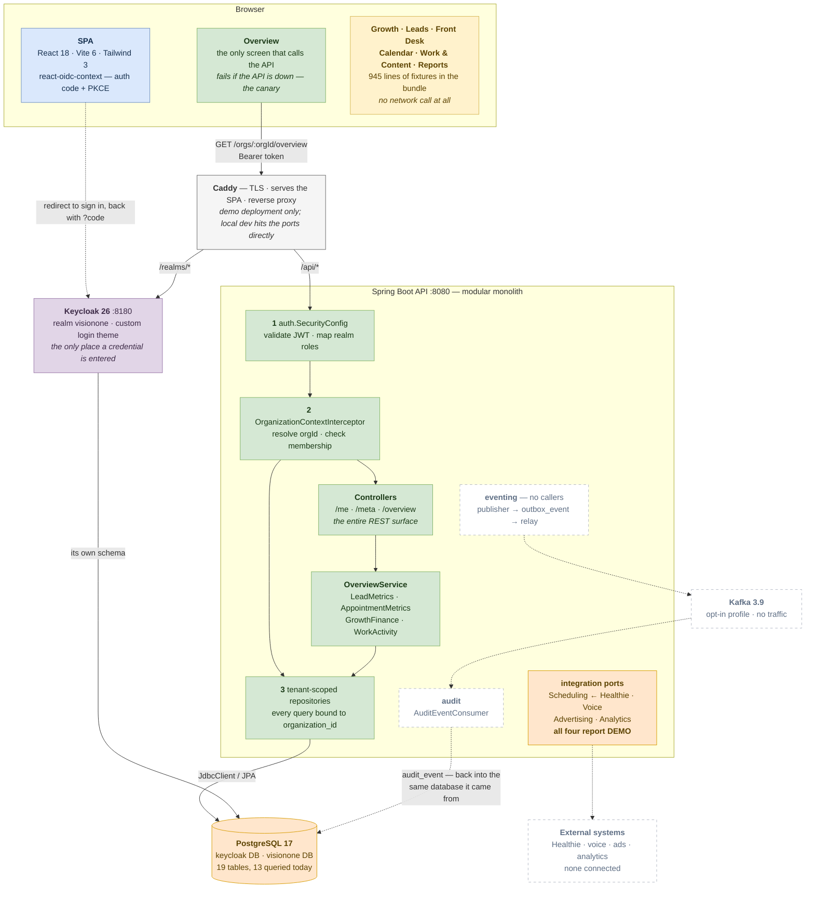

# Architecture notes

The authoritative architecture and delivery plan is the VisionOne Phase 1 document in the project
space. This file holds the parts a developer needs while in the code.

## The shape today

Everything below this heading is descriptive - what actually runs, as of the current commit. The
sections after it are normative: rules and recipes that hold regardless. Where the two appear to
disagree, they do not. "Adding an event" tells you how to publish one; this section records that
nothing publishes one yet.

### The whole picture

An editable version lives at [`architecture.drawio`](architecture.drawio) — open it at
[diagrams.net](https://app.diagrams.net) or with the Draw.io extension in VS Code. The diagram
below is the same picture, and renders inline on GitHub.



Solid edges carry traffic today. Dashed edges are built, wired and idle — the eventing pipeline
has no callers, and every provider adapter is a `Demo*` class.

Two things the picture is meant to make obvious. Postgres is not optional at any point: Keycloak
stores its realm, users and sessions there, so the container stays even if the application
persisted nothing of its own. And the six fixture-backed screens have no edge leaving them at all,
which is the honest shape of the product today.

### Sign-in

```
  SPA /login
    └─▶ redirect ──▶ Keycloak /realms/visionone/protocol/openid-connect/auth
                       └── themed login page  (CSS-only theme over keycloak.v2)
                            └─▶ redirect back with ?code
                                 └── react-oidc-context exchanges code → token (PKCE)
                                      └── AuthBootstrap publishes token during render
                                           └── every apiGet sends Authorization: Bearer
```

The SPA never handles a credential, which is why the sign-in page is themed at Keycloak rather
than built in React. Theming it CSS-only means OTP, password reset and consent inherit the styling
without a forked template.

### The live request path

`GET /api/v1/orgs/{orgId}/overview` is the only endpoint that reads business data.

```
  ① auth.SecurityConfig ................ validate JWT, map realm roles
  ② OrganizationContextInterceptor ..... resolve {orgId}, verify membership
  ③ tenant-scoped repositories ......... every query bound to organization_id
        │
  OverviewController
        └── OverviewService
              ├── LeadMetrics        ◀── LeadMetricsService         ┐
              ├── AppointmentMetrics ◀── AppointmentMetricsService  │ JdbcClient
              ├── GrowthFinance      ◀── GrowthFinanceService       │
              ├── WorkActivity       ◀── WorkActivityService        ┘
              └── JdbcClient (direct)
                     └──▶ PostgreSQL
```

Injection is by interface, so the implementing classes are never named by another class. Static
"who references this" tooling reports them as unused; they are not.

### Screens without a backend

```
  Growth · Leads · Front Desk · Calendar · Work & Content · Reports
     └── import demoData.ts │ demoOperations.ts │ demoCalendar.ts
            945 lines of fixtures, compiled into the bundle, zero API calls
```

Six of the seven screens render from fixtures. Overview is the only one that fails when the API is
down, which makes it the useful canary. `content` and `frontdesk` exist as empty packages holding
those names on the backend side.

### Provider ports

```
  integration.api  (port)          integration.internal  (adapter)      status
  ─────────────────────────────────────────────────────────────────────────────
  SchedulingProvider  ← Healthie   DemoSchedulingProvider               DEMO
  VoiceProvider                    DemoVoiceProvider                    DEMO
  AdvertisingProvider              DemoAdvertisingProvider              DEMO
  AnalyticsProvider                DemoAnalyticsProvider                DEMO
```

Each is `@ConditionalOnProperty(havingValue = "DEMO", matchIfMissing = true)` and reports `DEMO`
verbatim rather than implying a connection. The port is the PHI boundary:
`appointment_reference` holds an external ref, timestamps and a status, never a patient name or
anything clinical.

### Eventing, wired but not yet used

```
   (no callers)
        ┊
        ┄┄▶ DomainEventPublisher ┄┄▶ outbox_event ┄┄▶ OutboxRelay ┄┄▶ Kafka
                                                                        ┊
                     audit_event  ◀┄┄  AuditEventConsumer  ◀┄┄──────────┘
```

Dashed because there are currently no `.publish(...)` call sites, and the single consumer writes
back to the same database the event came from. The pipeline is complete and correct; it is ahead
of the writes that will feed it. Follow "Adding an event" below when adding the first one.

### Which tables are live

Thirteen of the nineteen tables are queried today. The six that are not map onto the six mocked
screens, so the schema is ahead of the API rather than dead:

Queried: `organization`, `membership`, `lead`, `lead_status_history`, `appointment_reference`,
`budget_allocation`, `growth_plan`, `channel_source`, `work_item`, `recommendation`, `audit_event`,
`outbox_event`, `processed_event`.

Not yet queried, and the screen each is waiting on:

| Table | Waiting on |
| --- | --- |
| `call` | Front Desk |
| `campaign` | Growth |
| `content_item` | Work & Content |
| `metric_snapshot`, `monthly_report` | Reports |
| `integration_connection` | provider status |

## Module dependency rules

1. Any module may depend on `auth`, `tenant` and `eventing`. Those three depend on nothing above.
2. No module imports another module's `internal`, `domain` or `repository` package. Cross-module
   reads go through `api` interfaces or through Kafka.
3. `reporting` and `audit` are read-only consumers. Neither writes another module's tables.
4. No cyclic dependency between modules.
5. Controllers never return JPA entities.

`ModuleBoundaryTest` enforces 1 through 5.

## The three layers of tenant safety

| Layer | Where | What it does |
| --- | --- | --- |
| 1 | `auth.SecurityConfig` | Validates the JWT and the caller's role |
| 2 | `tenant.internal.OrganizationContextInterceptor` | Resolves `{orgId}` and checks membership |
| 3 | Tenant-scoped repositories | Every query constrained by organization |

A Kafka consumer has no request and therefore no context. Consumers read `organizationId` from
the event envelope and pass it explicitly. A consumer reaching for the ambient context is a
tenant-isolation bug.

## Adding an event

1. Add a constant to `EventType`, with its topic.
2. Publish through `DomainEventPublisher` inside the transaction that made the change.
3. Consume with `@KafkaListener`, wrapping the work in `IdempotentConsumer.once(...)`.
4. Add a replay test: the same event twice must not double the derived number.

Do not add an event for ordinary CRUD. If the caller needs the result in the same request, it is
not an event.

## Adding a channel

A channel is a row in `channel_source`, not a module and not a screen. Google Ads, Meta, SEO and
local search are all rows. If a channel later needs its own screen, it becomes a sub-package of
`growth` before it becomes a module.

## Where Valkey would go

Shared membership cache, outbox-relay leader election, and idempotency keys, when a second
application instance runs. Everything cacheable is already behind Spring's `CacheManager`, so it
is a configuration swap. It is not deployed in Phase 1 and should not be.
